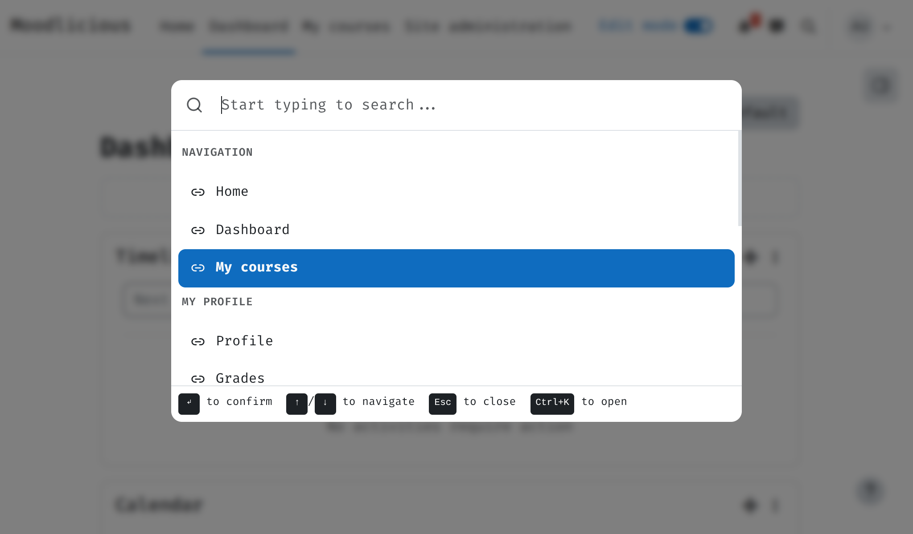

# Wayfinder

Cmd+K command palette for Moodle. Like Spotlight, VS Code palette, or Alfred -- but inside Moodle.

## What It Does

Press `Ctrl+K` (or `Cmd+K` on Mac). A search dialog opens. Type to find anything: courses, admin pages, user profile, navigation links. Select to go there. Also: purge caches, switch language, browse admin tree -- all from one palette.

## Pages

| Page | Description |
|------|-------------|
| [Installation](installation.md) | Requirements and setup |
| [Usage](usage.md) | Hotkeys, search, built-in commands |
| [Architecture](architecture.md) | How it works: items, actions, React |
| [Extending](extending.md) | Add new commands, groups, actions |
| [Development](development.md) | Build JS, SCSS, tests, CI |
